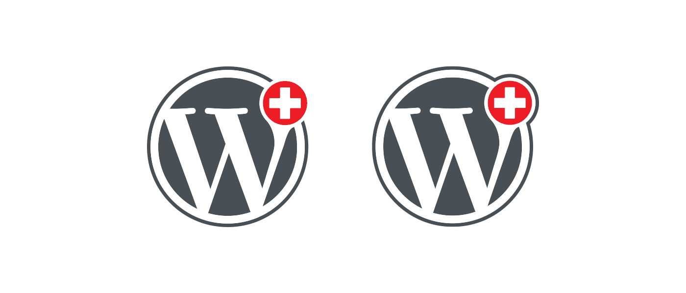

# Logo of the WordPress community Switzerland

This logo was made to represent the WordPress community of Switzerland. It shows the official WordPress logo with a round Swiss flag. There are two versions available. 

# Wapuu

The Swiss Wapuu was [first published](https://wapu.us/wapuu/swiss-wapuu/) in 2015, after being created for WordCamp Switzerland in that year.

# Usage

The files in this repository can be used for WordPress Meetups and WordCamps, which are open for everyone, without any attribution.
